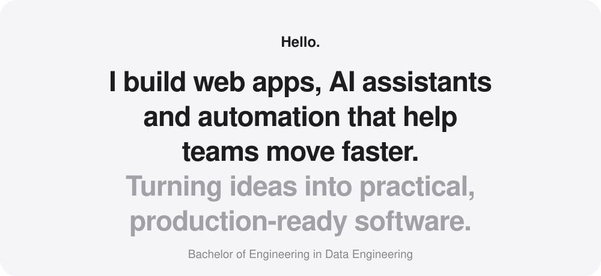
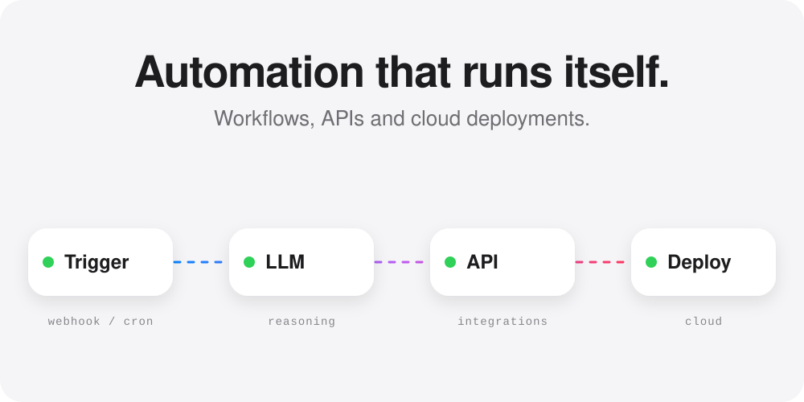
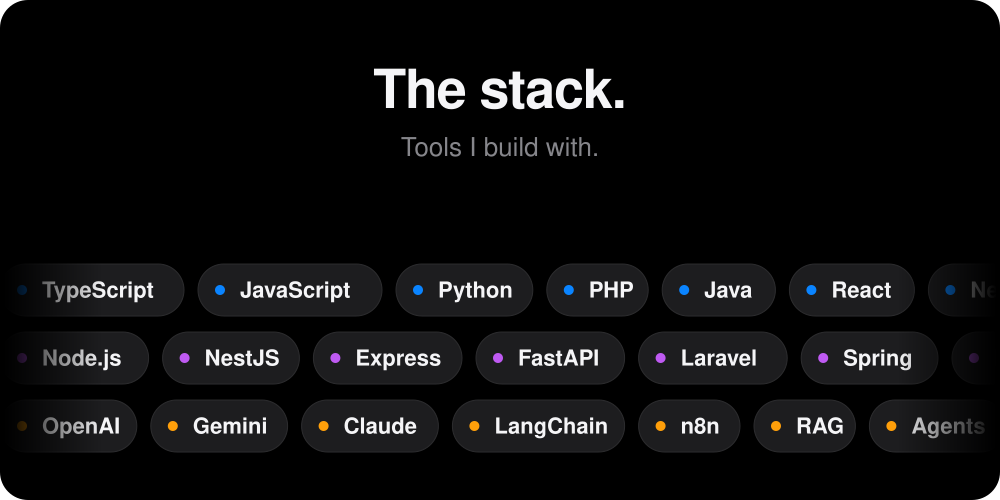

 

<a href="https://github.com/nnqhdev">GitHub&nbsp;›</a> &nbsp;&nbsp;&nbsp;&nbsp;
<a href="https://www.linkedin.com/in/nnqhdev/">LinkedIn&nbsp;›</a> &nbsp;&nbsp;&nbsp;&nbsp;
<a href="https://www.youtube.com/@nnqhdev">YouTube&nbsp;›</a> &nbsp;&nbsp;&nbsp;&nbsp;
<a href="https://www.facebook.com/nnqhdev">Facebook&nbsp;›</a> &nbsp;&nbsp;&nbsp;&nbsp;
<a href="mailto:hung264656@gmail.com">Email&nbsp;›</a>

 
 

 

