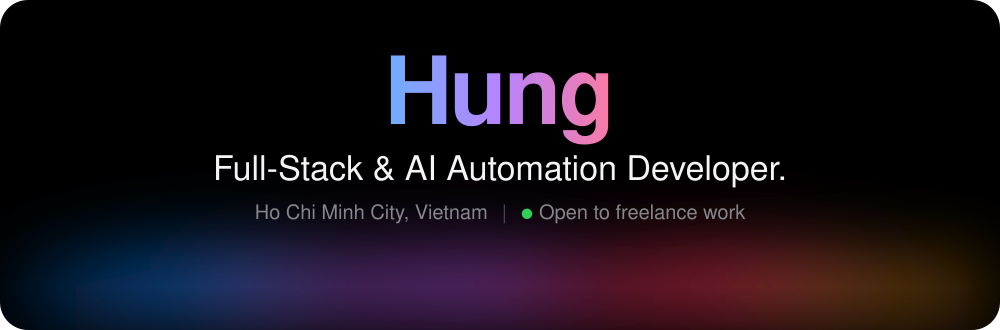
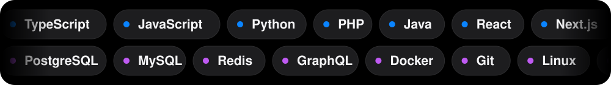

 
 

<a href="https://github.com/nnqhdev">GitHub&nbsp;›</a> &nbsp;&nbsp;&nbsp;&nbsp;
<a href="https://www.linkedin.com/in/nnqhdev/">LinkedIn&nbsp;›</a> &nbsp;&nbsp;&nbsp;&nbsp;
<a href="https://www.youtube.com/@nnqhdev">YouTube&nbsp;›</a> &nbsp;&nbsp;&nbsp;&nbsp;
<a href="https://www.facebook.com/nnqhdev">Facebook&nbsp;›</a> &nbsp;&nbsp;&nbsp;&nbsp;
<a href="mailto:hung264656@gmail.com">Email&nbsp;›</a>

 
 

Modern, scalable web and mobile apps, built for production. 
Next.js · React · Vue · React Native · Tailwind CSS · Node.js · NestJS · FastAPI · Laravel · Spring

Chatbots and multi-model LLM assistants (RAG, agents) that work around the clock. 
OpenAI · Gemini · Claude · LangChain

Workflows, APIs and cloud deployments that help teams operate faster. 
n8n · FastAPI · NestJS · Docker · Git · Linux

Bachelor of Engineering in Data Engineering

